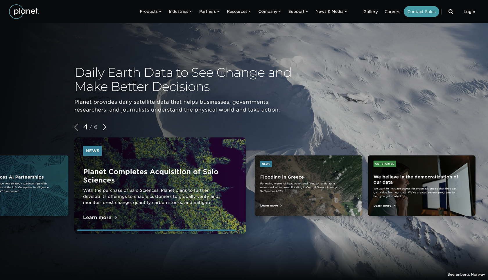
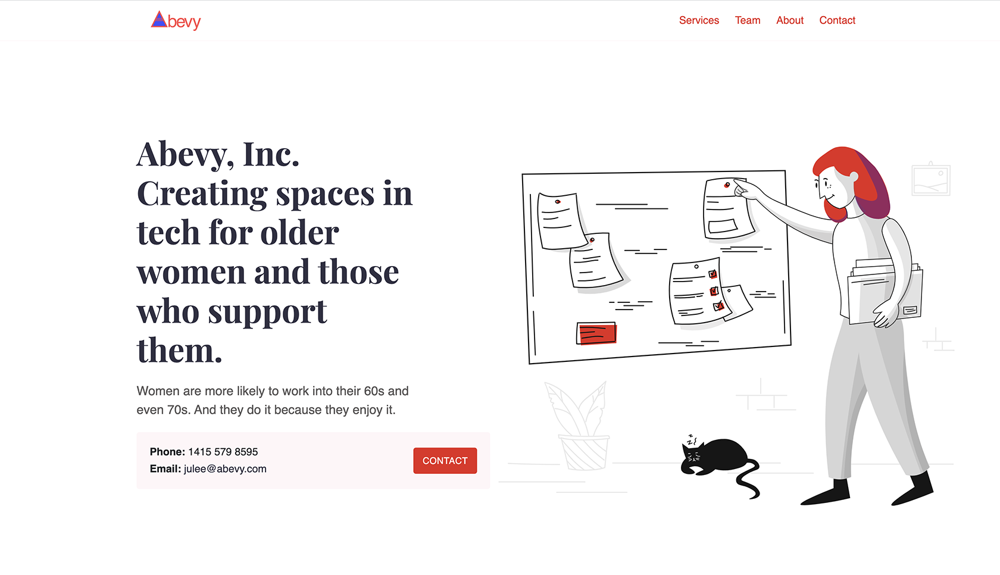
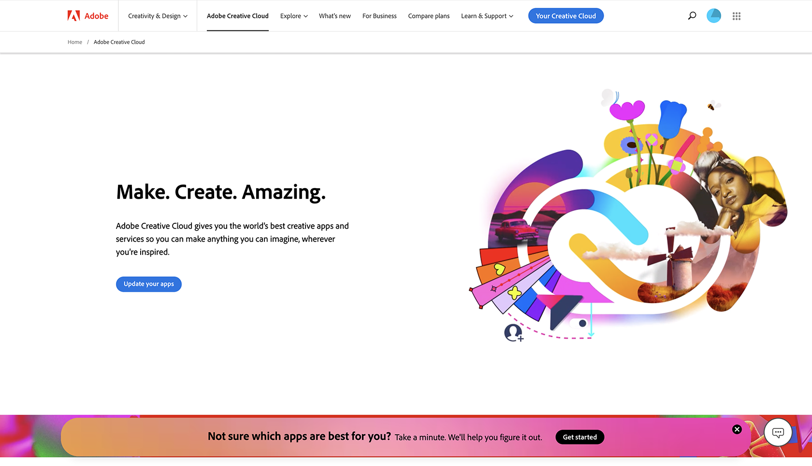

<h2 class="portfolio-landing-h2">Continuous content, continuous improvement at Planet Labs</h2>

<h2 class="portfolio-landing-h2">Making social impact at Abevy, Inc.</h2>

<h2 class="portfolio-landing-h2">Life science frontend development at Viscira, LLC</h2>

<h2 class="portfolio-landing-h2">Content strategy & engineering at Adobe</h2>

<h2 class="portfolio-landing-h2">Technical content at RSA</h2>

