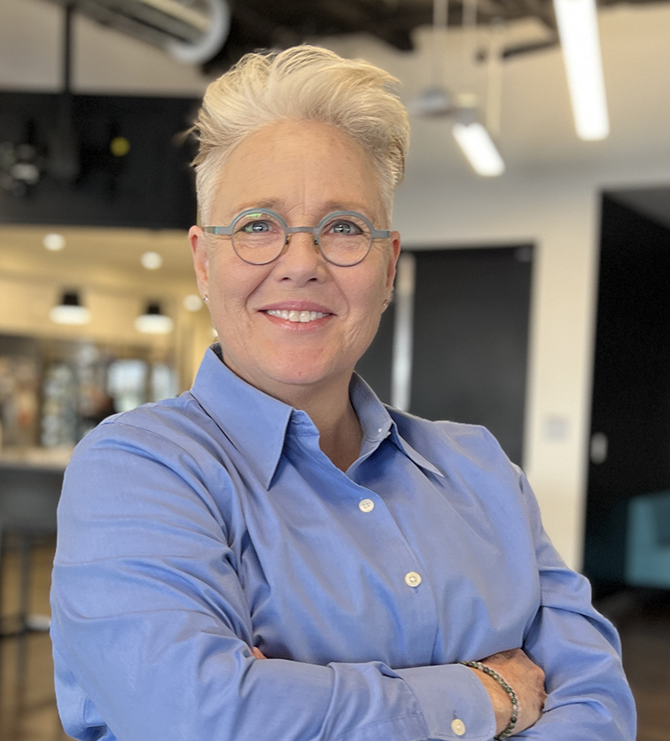

# Resume {#resume-h1}

{: width=" 100vw"}

## Summary

!!!tip inline end "LinkedIn"

    For a detailed view of my endeavors, see my [linkedin.com/in/jburdekin](https://www.linkedin.com/in/jburdekin/){:target="_blank"} profile.

Technologist and strategic leader with a proven performance history in content development and engineering, developer relations, and technical design across industry-leading organizations. Excellent at managing teams, advocating for content experience, and championing cross-functional collaboration while driving innovation and operational excellence.

## Experience

### Technical Content Engineer

#### Geospan, Inc.

##### August 2024 - Present

Leading content engineering and strategy for new engineering team. Writing developer documentation and code examples in Python and JavaScript frameworks. Mentoring leadership and engineers in knowledge systems, information architecture, and content operations. Built first-generation developer docs, Postman collections, and Hugo CMS redesign while implementing HubSpot Knowledge Base and launching internal developer experience.

### Head of Developer Relations

#### Planet Labs, PBC

##### October 2021 - October 2023

Scaled from Developer Relations content developer to Head of Developer Relations. Led development of Planet SDK and CLI for Python while managing platform content systems and publication channels. Built knowledge systems serving agriculture, forestry, and government sectors through remote sensing, GIS, geospatial data platform.

### Founder & CEO

#### Abevy, Inc

##### 2017 - June 2024

This benefit corporation provided technical forums for older women and their supporters. Identified and developed new product prototypes based on real-life problems. Set corporate strategy and operational frameworks while managing presentation layers and content for product releases. Planned and assembled skills-based teams within inclusive culture.

### Senior Web Developer & Technical Lead

#### Viscira, Inc

##### October 2016 - February 2019

Developed frontend experiences and mobile media communication solutions for life sciences and pharmaceutical clients. Led web and mobile development teams while delivering rapid development solutions using modern web stack (Angular, React, D3, GSAP, Bootstrap). Specialized in responsive web applications, data visualization, and Salesforce Lightning platform development.

### Senior Editorial Manager & Content Strategist

#### Adobe Systems, Inc

##### July 2000 - March 2015

Led content strategy for Adobe's web platform. Built data pipelines with SQL, Hadoop, Hive, and NLTK. Served as W3C Steward Representative for global developer knowledge systems.

Launched web standards content experiences and managed expert contributor networks. Built developer communities around Adobe web technologies.

Created predictive dashboard analyzing developer pain points through behavioral/sentiment metrics. Led technical analysis of CRMs and knowledge bases, implementing SEO optimization and Experience Manager integrations. Product managed ActionScript Reference platform.

Managed teams producing ActionScript/JavaScript frameworks for AIR and Flash Platform. Directed cross-functional delivery into Flex, Flash Professional, and SaaS products while building content workflow systems.

At Macromedia (acquired by Adobe 2006), led documentation architecture for Dreamweaver, Flash, ActionScript, and Flash Media Server. Managed writer/developer teams, established content standards, and implemented automated tooling (Doxygen, ASDoc). Introduced automation tools and guided ASDoc roadmap development.

### Lead Writer

#### RSA Security, Inc

##### 1995 - 2000

Led API documentation teams for cryptographic security products. Managed cross-functional teams including engineers and developer support, creating comprehensive documentation for certificate servers and desktop security software.

## Education

### Mills College, Oakland, California

##### 1995

BA, English, Interdisciplinary Studies in Computer Science, Philosophy of Science

:fontawesome-solid-paper-plane: <juburdekin@gmail.com>{:target="_blank"} | :fontawesome-brands-linkedin: [linkedin.com/in/jburdekin](https://www.linkedin.com/in/jburdekin/){:target="_blank"}
